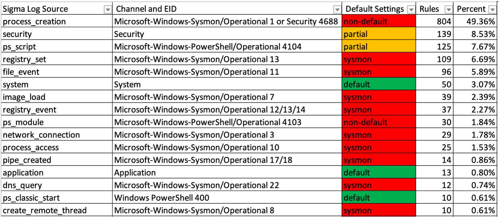
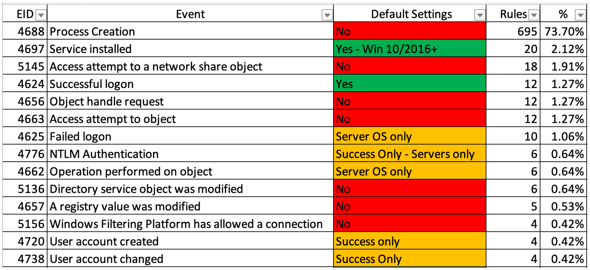

<div align="center">
 <h1>
    大和セキュリティによる、DFIRと脅威ハンティングのためのWindowsイベントログ設定の究極ガイド
 </h1>
 [<a href="README.md">English</a>] | [<b>日本語</b>]
</div>
<p>

これは、Windowsのイベントログの設定と監視に関するガイドで、Sigmaルールが何かを検出するために、また正しいDFIR調査のために適切なログを有効にすることに重点を置いています。

# TLDR

* Windowsのデフォルトの監査設定では[sigma](https://github.com/SigmaHQ/sigma)ルールの10~20%程度しか利用できません。
* Windowsのログが有効になっていても、デフォルトではログの最大サイズがたった1〜20MBなので、すぐに証拠が上書きされてしまう可能性が高いです。
* Sigmaルールの約75%まで利用可能にし、必要なだけログを保持するように[YamatoSecurityConfigureWinEventLogs.bat](YamatoSecurityConfigureWinEventLogs.bat)の導入で適切な監査設定を行いましょう。
    - **注意: 必要に応じてスクリプトをカスタマイズし、本番環境で導入する前に必ずテストしてください！**
* 100%のSigmaルールを利用したい方は、[sysmon](https://learn.microsoft.com/en-us/sysinternals/downloads/sysmon)を導入する必要があります。（お勧め！）

## 目次

- [TLDR](#tldr)
  - [目次](#目次)
- [作者](#作者)
- [コントリビュータ](#コントリビュータ)
- [Acknowledgements](#acknowledgements)
- [デフォルトの Windows ログ設定の問題](#デフォルトの-windows-ログ設定の問題)
- [注意: 端末の設定変更は自己責任で！](#注意-端末の設定変更は自己責任で)
- [重要な Windowsイベントログ](#重要な-windowsイベントログ)
  - [Sigmaのトップログソース](#sigmaのトップログソース)
    - [上位のSigmaログソース](#上位のsigmaログソース)
    - [上位のSecurityイベンドID](#上位のsecurityイベンドid)
- [最大ファイル サイズの増加](#最大ファイル-サイズの増加)
  - [オプション 1: イベントビューアー(手動)](#オプション-1-イベントビューアー手動)
  - [オプション 2: Windowsビルトインツール](#オプション-2-windowsビルトインツール)
  - [オプション 3: PowerShell](#オプション-3-powershell)
  - [オプション 4: グループポリシー](#オプション-4-グループポリシー)
- [ログ設定を改善するスクリプト](#ログ設定を改善するスクリプト)
- [ログ設定の改善](#ログ設定の改善)
  - [Sysmonログ (Sigmaルール1382件)](#sysmonログ-sigmaルール1382件)
  - [Securityログ (Sigmaルール 1045件(process creationルール903件 + その他ルール142件))](#securityログ-sigmaルール-1045件process-creationルール903件--その他ルール142件)
  - [Powershellログ (Sigmaルール 175件)](#powershellログ-sigmaルール-175件)
    - [モジュールログ (Sigmaルール 30件)](#モジュールログ-sigmaルール-30件)
      - [モジュールログの有効化](#モジュールログの有効化)
        - [オプション 1: グループポリシーによる有効化](#オプション-1-グループポリシーによる有効化)
        - [オプション 2: レジストリによる有効化](#オプション-2-レジストリによる有効化)
    - [スクリプトブロックログ (Sigmaルール 134件)](#スクリプトブロックログ-sigmaルール-134件)
      - [スクリプトブロックログの有効化](#スクリプトブロックログの有効化)
      - [オプション 1: グループポリシーによる有効化](#オプション-1-グループポリシーによる有効化-1)
      - [オプション 2: レジストリによる有効化](#オプション-2-レジストリによる有効化-1)
    - [トランスクリプションログ](#トランスクリプションログ)
      - [トランスクリプションログの有効化](#トランスクリプションログの有効化)
        - [オプション 1: グループポリシーによる有効化](#オプション-1-グループポリシーによる有効化-2)
        - [オプション 2: レジストリによる有効化](#オプション-2-レジストリによる有効化-2)
    - [参考記事](#参考記事)
  - [Systemログ (Sigmaルール 55件)](#systemログ-sigmaルール-55件)
  - [Applicationログ (Sigmaルール 16件)](#applicationログ-sigmaルール-16件)
  - [Windows Defender Operationalログ (Sigmaルール 10件)](#windows-defender-operationalログ-sigmaルール-10件)
  - [Bits-Client Operationalログ (Sigmaルール 6件)](#bits-client-operationalログ-sigmaルール-6件)
  - [Firewallログ (Sigmaルール 6件)](#firewallログ-sigmaルール-6件)
  - [NTLM Operationalログ (Sigmaルール 3件)](#ntlm-operationalログ-sigmaルール-3件)
  - [Security-Mitigations KernelModeとUserModeログ (Sigmaルール 2件)](#security-mitigations-kernelmodeとusermodeログ-sigmaルール-2件)
  - [PrintServiceログ (Sigmaルール 2件)](#printserviceログ-sigmaルール-2件)
    - [Adminログ (Sigmaルール 1件)](#adminログ-sigmaルール-1件)
    - [Operationalログ (Sigmaルール 1件)](#operationalログ-sigmaルール-1件)
  - [SMBClient Securityログ (Sigmaルール 2件)](#smbclient-securityログ-sigmaルール-2件)
  - [AppLockerログ (Sigmaルール 1件)](#applockerログ-sigmaルール-1件)
  - [CodeIntegrity Operationalログ (Sigmaルール 1件)](#codeintegrity-operationalログ-sigmaルール-1件)
  - [Diagnosis-Scripted Operationalログ (Sigmaルール 1件)](#diagnosis-scripted-operationalログ-sigmaルール-1件)
  - [DriverFrameworks-UserMode Operationalログ (Sigmaルール 1件)](#driverframeworks-usermode-operationalログ-sigmaルール-1件)
  - [WMI-Activity Operationalログ (Sigmaルール 1件)](#wmi-activity-operationalログ-sigmaルール-1件)
  - [TerminalServices-LocalSessionManager Operationalログ (Sigmaルール 1件)](#terminalservices-localsessionmanager-operationalログ-sigmaルール-1件)
  - [TaskScheduler Operationalログ (Sigmaルール 1件)](#taskscheduler-operationalログ-sigmaルール-1件)

# 作者
 
田中ザック (Zaku / [@yamatosecurity](https://twitter.com/yamatosecurity))。
より多くの研究とテストを行い、(検知ルールとドキュメンテーションの)改善の余地があるため、定期的に更新していく予定です。
PRは歓迎され、喜んでコントリビューターとして追加させていただきます。

もし、このガイドが役に立つのであれば、GitHubで星を付けてください。更新し続けるモチベーションが上がります。

# コントリビュータ

* DustInDark: 日本語版の修正。

# Acknowledgements

多くの情報はマイクロソフトの[詳細なセキュリティ監査に関するFAQ](https://learn.microsoft.com/ja-jp/windows/security/threat-protection/auditing/advanced-security-auditing-faq), [sigma](https://github.com/SigmaHQ/sigma)ルール, [ACSCのガイド](https://www.cyber.gov.au/acsc/view-all-content/publications/windows-event-logging-and-forwarding)、そして私自身の調査/テストから得たものです。特に[Sigmaコミュニティ](https://github.com/SigmaHQ/sigma/graphs/contributors)には、世の中のすべての防衛者のために脅威検知能力をオープンソースかつフリーにしてくれたことに感謝しています。

# デフォルトの Windows ログ設定の問題

デフォルトでは、Windows は悪意のあるアクティビティの検出と、フォレンジック調査の実行に必要な多くのイベントをログに記録しません。
また、イベントファイルのデフォルトの最大サイズは、クラッシックイベントログ(`Security`、`System`、`Application`)ではわずか20MB、PowerShellでは15MB、その他のほとんどすべてのログではわずか1MBであるため、証拠がすぐ上書きされる可能性が高くなります。
システム管理者が Windows端末を簡単に設定できるように、このリポジトリにはシンプルな[バッチスクリプト](YamatoSecurityConfigureWinEventLogs.bat)が用意されており、インシデントが発生したときに必要なログを取得できます。
大規模なネットワークの場合は、このドキュメントを参照として使用し、グループポリシーやInTuneを使用して端末を設定することをお勧めします。

# 注意: 端末の設定変更は自己責任で！

Windowsのデフォルトのイベントログ設定を改善することを強く推奨します。設定を改善することで最も正確な情報を提供できるようになります。
しかし、あまりにも多くのログを有効にすることによる悪影響や、このリポジトリ内の何かの正確性について、一切の責任を負いません。
本番環境に導入する前に、設定変更を十分理解した上で、テスト端末で十分テストすることは、システム管理者の責任です。
環境を模倣したテスト端末で、少なくとも1週間はできるだけ多くのログ記録を有効にしてから、ノイズが多すぎるイベントがないか、必要なイベントが記録されているかどうかを確認することをお勧めします。

[Hayabusa](https://github.com/Yamato-Security/hayabusa)のイベントID集計機能を使用して、evtxファイル内のイベントIDの総数と割合を確認できます。

例：`hayabusa.exe -M -f path/to/Security.evtx`

# 重要な Windowsイベントログ

1. 有効にするべき最も重要なイベントログは、おそらく`Process Creation`(プロセス作成)のイベントで、システムで実行されているプロセスを追跡するものです。
 現在、Sigmaルールの約半分がこのイベントに依存しています。
 Sysmonをインストールして、イベントID`1`を有効にするか、ビルトインログ (SecurityイベントID`4688`)を有効にすることで記録できます。  
 `Sysmon 1`に、実行ファイルのハッシュ値やメタデータなどの詳細情報も記録されるので理想的ですが、Sysmonをインストールできない場合は、Windowsのビルトインログの`Security 4688`が使えます。
 ただし、多くの検知ルールがコマンドライン情報にあるシグネチャを探すため、コマンドライン情報も記録されるように設定すべきです。
 残念ながら`Security 4688`は、Sysmonプロセス作成ログほど詳細な情報は記録されないので、`Security 4688`に対応していない`Process Creation`検知ルールもあります。
2. 2番目に重要なイベントログは、適切に設定されたSecurityログです。
3. 攻撃者はPowerShellを悪用することが多いため、3番目に重要なのはおそらくPowerShellモジュールログとスクリプトブロックログです。
4. 4番目は、おそらく他のすべてのSysmonイベントです。
5. これらの他に、「アプリケーションとサービスログ」フォルダには、非常に重要な他の多くのログもあります:
 AppLocker, Bits-Client, NTLM, PowerShell, PrintService, Security-Mitigations, Windows Defender, Windows Firewall With Advanced Security, WMI-Activity等々。

## Sigmaのトップログソース


デフォルトのWindows監査設定で使用できるSigmaルールは、約10〜20%です。

### 上位のSigmaログソース



### 上位のSecurityイベンドID



# 最大ファイル サイズの増加

## オプション 1: イベントビューアー(手動)

これを大規模に行うのは現実的ではありませんが、ログの有効、無効を変更し、最大ファイル サイズを確認および構成する最も簡単な方法は、イベントビューアーでログを右クリックし、`プロパティ`を開くことです。

## オプション 2: Windowsビルトインツール

ビルトインツールのwevtutilコマンドを使用できます。

例: `wevtutil sl Security /ms:1073741824` (セキュリティログの最大ファイルサイズを1GBに増やす)

## オプション 3: PowerShell

例:
```powershell
$sysmon = Get-WinEvent -ListLog Microsoft-Windows-Sysmon/Operational
$sysmon.MaximumSizeInBytes = 2048000000 #2GB
$sysmon.SaveChanges()
```

## オプション 4: グループポリシー

`Security`、`System`、`Application`などのクラッシックイベントログの最大ファイルサイズを増やすのは簡単ですが、他のイベントログの最大ファイルサイズを変更するには、残念ながら、管理用テンプレートをインストールするか、レジストリを直接変更する必要があります。
起動時に`.bat`スクリプトを使用して最大ファイルサイズを増やした方が簡単な場合があります。

# ログ設定を改善するスクリプト

最大ファイルサイズを増やして適切なログを有効にするスクリプトが、[YamatoSecurityConfigureWinEventLogs.bat](YamatoSecurityConfigureWinEventLogs.bat)で提供されています。

# ログ設定の改善

## Sysmonログ (Sigmaルール1382件)

ファイル: `Microsoft-Windows-Sysmon%4Operational.evtx`

デフォルトの設定: `インストールされていない`

sysmonをインストールして設定することは、Windows端末での可視性を高めるための最善の方法ですが、計画、テスト、およびメンテナンスが必要になります。

Sysmonはそれ自体大きなトピックなので、現時点ではこのドキュメントの範囲外です。
次のリソースを確認することをお勧めします。

* [TrustedSecのSysmonコミュニティガイド](https://github.com/trustedsec/SysmonCommunityGuide)
* [Sysmon Modular](https://github.com/olafhartong/sysmon-modular)
* [Florian Roth氏によるSwift On SecurityのSysmon設定ファイルを更新しているフォーク](https://github.com/Neo23x0/sysmon-config)
* [Ion-storm氏によるSwift On SecurityのSysmon設定ファイルを更新しているフォーク](https://github.com/ion-storm/sysmon-config)
* [Cyb3rWard0g氏のsysmon設定ファイル](https://github.com/OTRF/Blacksmith/blob/master/resources/configs/sysmon/sysmon.xml)

## Securityログ (Sigmaルール 1045件(process creationルール903件 + その他ルール142件))

ファイル: `Security.evtx`

デフォルトの設定: `一部有効`

Securityログの設定が最も複雑なため、別のドキュメントを用意しました: [ConfiguringSecurityLogAuditPolicies-Japanese.md](ConfiguringSecurityLogAuditPolicies-Japanese.md)

## Powershellログ (Sigmaルール 175件)

ファイル: `Microsoft-Windows-PowerShell%4Operational.evtx`

### モジュールログ (Sigmaルール 30件)

モジュールログを有効にすると、イベントID`4103`が記録されます。
モジュールログには、古いOSやバージョンのPowerShellでも動作する利点がある: PowerShell 3.0 (Win 7+)。
また、実行したPowerShellコマンドとその結果の両方をログに残すことができるのも利点です。
デメリットは、イベント数が極端に多くなってしまうことです。
例えば、攻撃者がMimikatzを実行した場合、2000以上のイベントを含む7MBのログが作成されます！

#### モジュールログの有効化

デフォルトの設定: `監査なし`

##### オプション 1: グループポリシーによる有効化

グループポリシーエディター(`gpedit.msc`)で、`コンピューターの構成 > 管理用テンプレート > Windowsコンポーネント > Windows PowerShell`を開き、`モジュールログを有効にする`を有効にします。
`オプション`ペインで、`表示...`ボタンをクリックすると、ログを記録するモジュールを設定できます。
すべてのモジュールを記録するには、`値`テキストボックスに`*`を入力します。

##### オプション 2: レジストリによる有効化

```
HKLM\SOFTWARE\Wow6432Node\Policies\Microsoft\Windows\PowerShell\ModuleLogging → EnableModuleLogging = 1
HKLM\SOFTWARE\Wow6432Node\Policies\Microsoft\Windows\PowerShell\ModuleLogging\ModuleNames → * = *
```

### スクリプトブロックログ (Sigmaルール 134件)

デフォルトの設定: `Win 10/2016以降では、PowerShellスクリプトがAMSIによって疑わしいと判定された場合、警告レベルでログに記録されるが、その他のログは記録されない`

スクリプトブロックログを有効にすると、イベントID`4104`が記録されます。`スクリプトブロックの呼び出し開始/停止イベントをログに記録する`も有効にすると イベントID`4105`と`4106`も有効になりますが、ノイズが増えるだけなので推奨されません。
PowerShell 5.0+ (Win 10+)ではデフォルトでサポートされていますが、.NET 4.5とWMF 4.0+をインストールすれば、古いOS (Win 7+)でも有効にすることができます。
残念ながら、1つのWindowsイベントログの最大サイズは32KBなので、これより大きいPowerShellスクリプトは32KBサイズのブロックに分割されます。
もし、元々のPowerShell Operational`.evtx`ファイルがあれば、[block-parser](https://github.com/matthewdunwoody/block-parser)ツールを使って、これらのログを読みやすい一つのテキストファイルにもとめることができます。
スクリプトブロックログの良い点は、悪意のあるスクリプトがXOR、Base 64、ROT13などで難読化されていても、解読されたスクリプトが記録されるため、解析が非常に容易になる点です。
攻撃者がMimikatzを実行した場合、7MBで2000以上のイベントが発生するのに比べ、5MBで約100件のイベントが発生するだけなので、モジュールログよりも解析しやすいです。
ただし、スクリプトブロックログでは、コマンドの出力は記録されません。

#### スクリプトブロックログの有効化

#### オプション 1: グループポリシーによる有効化

グループポリシーエディターで、`コンピューターの構成 > 管理用テンプレート > Windowsコンポーネント > Windows PowerShell`を開き、`PowerShellスクリプトブロックのログ記録を有効にする`を有効にします。

#### オプション 2: レジストリによる有効化

`HKLM\SOFTWARE\Wow6432Node\Policies\Microsoft\Windows\PowerShell\ScriptBlockLogging → EnableScriptBlockLogging = 1`

### トランスクリプションログ

デフォルトの設定: `監査なし`

トランスクリプションログを有効にすることでPowerShellログをローカル端末のテキストファイルに保存することも可能です。
攻撃者は通常、アンチフォレンジックのためにトランスクリプションログを簡単に削除することができますが、攻撃者がすべてのイベントログを消去しても、トランスクリプションログを検索して削除しないシナリオもあるかもしれません。
そのため、可能であればトランスクリプションログも有効にすることをお勧めします。
デフォルトでは、ユーザのドキュメントフォルダに保存されます。
理想的には、トランスクリプトログは書き込み専用のネットワークファイル共有に保存されるべきであるが、実際にはこれを実施することは難しいです。
トランスクリプションログの利点は、各コマンドのタイムスタンプとメタデータを含み、Mimikatz実行時に6KB以下と非常にストレージ効率が良いことです。
欠点は、トランスクリプションログがPowerShellのターミナルに表示されるテキストしか記録されないことです。

#### トランスクリプションログの有効化

##### オプション 1: グループポリシーによる有効化

グループポリシーエディターで、`コンピューターの構成 > 管理用テンプレート > Windowsコンポーネント > Windows PowerShell`を開き、`PowerShellトランスクリプションを有効にする`を有効にします。
その後、出力ディレクトリを指定します。

##### オプション 2: レジストリによる有効化

```
HKLM\SOFTWARE\Wow6432Node\Policies\Microsoft\Windows\PowerShell\Transcription → EnableTranscripting = 1
HKLM\SOFTWARE\Wow6432Node\Policies\Microsoft\Windows\PowerShell\Transcription → EnableInvocationHeader = 1
HKLM\SOFTWARE\Wow6432Node\Policies\Microsoft\Windows\PowerShell\Transcription → OutputDirectory = “” (パスを入力する。空白の場合はデフォルトのパス。)
```

### 参考記事

* [Mandiant Blog: Greater Visibility Through PowerShell Logging](https://www.mandiant.com/resources/blog/greater-visibilityt)

## Systemログ (Sigmaルール 55件)

ファイル: `System.evtx`

デフォルトの設定: `有効。20 MB`

マルウェアはしばしば、永続化、ローカル特権昇格などのためにサービスをインストールします。その痕跡がこのログに残ります。
また、このログから様々な脆弱性が悪用されていることを検出することが可能です。

## Applicationログ (Sigmaルール 16件)

ファイル: `Application.evtx`

デフォルトの設定: `有効。20 MB`

このログはほとんどノイズですが、ここに重要な証拠を見つけることができるかもしれません。
注意点としては、異なるベンダーが異なるイベントに同じイベントIDを使用するため、イベントIDだけでなくプロバイダ名でもフィルタリングする必要があることです。

## Windows Defender Operationalログ (Sigmaルール 10件)
 
ファイル: `Microsoft-Windows-Windows Defender%4Operational.evtx`

デフォルトの設定: `有効。1 MB`

（重要な監視項目の）Windows Defenderのアラートだけでなく、除外項目が追加された、改ざん防止機能が無効になった、履歴が削除された、などのイベントも検出できます。

## Bits-Client Operationalログ (Sigmaルール 6件)
 
ファイル: `Microsoft-Windows-Bits-Client%4Operational.evtx`

デフォルトの設定: `有効。1 MB`

Bitsadmin.exeは、攻撃者がマルウェアのダウンロードや実行に悪用する一般的な[lolbin](https://lolbas-project.github.io/lolbas/Binaries/Bitsadmin/)です。
このログを見れば、その証拠が見つかるかもしれません。
ただし、誤検出が多いので、注意が必要です。

## Firewallログ (Sigmaルール 6件)

ファイル: `Microsoft-Windows-Windows Firewall With Advanced Security%4Firewall.evtx`

デフォルトの設定: `有効？ 1 MB`

ファイアウォールのルールが追加/変更/削除された形跡は、こちらで確認できます。
マルウェアはしばしば、C2サーバと通信できるようにファイアウォールルールを追加したり、横展開するためにプロキシルールを追加したりします。

## NTLM Operationalログ (Sigmaルール 3件)

ファイル: `Microsoft-Windows-NTLM%4Operational.evtx`

デフォルトの設定: `ログ自体は有効になっているが、監査設定は無効になっている。1 MB`

NTLM認証を無効にしたい場合、このログを有効にすることをお勧めします。
NTLMを無効にすると、ほとんどの場合、一部の端末が接続できなくなるため、まずDCや他のサーバでこのログを監視して、誰がまだNTLMを使用しているかを確認し、それらのユーザから徐々にNTLMを無効にしてから、グローバルに無効にすることを推奨します。
4624などのログオンイベントで、内向きの接続にNTLMが使用されていることを確認できますが、誰がNTLMで外向きに接続をしているかを監視したい場合は、このログを有効にする必要があります。

監査設定を有効にするために、グループポリシーで`コンピューターの構成 > Windowsの設定 > セキュリティの設定 > ローカルポリシー > セキュリティオプション`配下の`ネットワークセキュリティ: NTLMを制限する:`の様々な設定を正しく設定する必要があります。

参考記事: [Farewell NTLM](https://www.scip.ch/en/?labs.20210909)

## Security-Mitigations KernelModeとUserModeログ (Sigmaルール 2件) 

ファイル: `Microsoft-Windows-Security-Mitigations%4KernelMode.evtx`, `Microsoft-Windows-Security-Mitigations%4UserMode.evtx`

デフォルトの設定: `有効。1 MB`

現時点では、これらのログに対して2件のSigmaルールしかありませんが、エクスプロイト保護、ネットワーク保護、コントロールされたフォルダーアクセス、攻撃面の縮小(ASR)のすべてのログ（約40以上のイベントID）を収集し、監視すべきです。
残念ながら、攻撃面の縮小(ASR)のログ（以前はWDEG(Windows Defender Exploit Guard)とEMET）は複数のログに分散しており、検索するには複雑なXMLクエリが必要です。

詳細: [攻撃面の縮小機能を理解して使用する](https://learn.microsoft.com/ja-jp/microsoft-365/security/defender-endpoint/overview-attack-surface-reduction?view=o365-worldwide)

## PrintServiceログ (Sigmaルール 2件)

印刷スプーラーへの攻撃を検知するために、Operationalログを有効にすることを推奨します。(例: PrintNightmare等々)

### Adminログ (Sigmaルール 1件)

ファイル: `Microsoft-Windows-PrintService%4Admin.evtx`

デフォルトの設定: `有効。1 MB`

### Operationalログ (Sigmaルール 1件)

ファイル: `Microsoft-Windows-PrintService%4Operational.evtx`

デフォルトの設定: `無効。1 MB`

## SMBClient Securityログ (Sigmaルール 2件) 

ファイル: `Microsoft-Windows-SmbClient%4Security.evtx`

デフォルトの設定: `有効。8 MB`

PrintNightmare攻撃 (ルール: `Suspicious Rejected SMB Guest Logon From IP`)や隠し共有をマウントするユーザを検出できます。

## AppLockerログ (Sigmaルール 1件) 

ファイル: `Microsoft-Windows-AppLocker%4MSI and Script.evtx`, `Microsoft-Windows-AppLocker%4EXE and DLL.evtx`, `Microsoft-Windows-AppLocker%4Packaged app-Deployment.evtx`, `Microsoft-Windows-AppLocker%4Packaged app-Execution.evtx`

デフォルトの設定: `AppLockerが有効の場合、有効？ 1 MB`

AppLockerを使用している場合、有効になっているか確認し、監視することが重要です。

## CodeIntegrity Operationalログ (Sigmaルール 1件)

ファイル: `Microsoft-Windows-CodeIntegrity%4Operational.evtx`

デフォルトの設定: `有効。1 MB`

このログを確認すると、Windowsのコード整合性チェックでブロックされたドライバーのロードイベントを検出することができます。そのため、ロードに失敗した悪意のあるドライバーを示すことがあります。

## Diagnosis-Scripted Operationalログ (Sigmaルール 1件) 

ファイル: `Microsoft-Windows-Diagnosis-Scripted%4Operational.evtx`

デフォルトの設定: `有効。1 MB`

diagcabパッケージが悪用された証拠は、こちらで確認できます。

## DriverFrameworks-UserMode Operationalログ (Sigmaルール 1件) 

ファイル: `Microsoft-Windows-DriverFrameworks-UserMode%4Operational.evtx`

デフォルトの設定: `監査なし。1 MB`

接続されたUSBデバイスの痕跡がここで記録されます。

## WMI-Activity Operationalログ (Sigmaルール 1件) 

ファイル: `Microsoft-Windows-WMI-Activity%4Operational.evtx`

デフォルトの設定: `Win10以降では有効になっている。1 MB`

攻撃者はしばしばWMIを悪用して永続化や横展開するので、このログを監視することは重要です。

## TerminalServices-LocalSessionManager Operationalログ (Sigmaルール 1件) 

ファイル: `Microsoft-Windows-TerminalServices-LocalSessionManager%4Operational.evtx`

デフォルトの設定: `有効。1 MB`

リバースプロキシツールであるngrokが、ファイアウォールを迂回するためにローカルRDPポートに通信を転送した場合に検出します。

リンク: [Bypassing Network Restrictions Through RDP Tunneling](https://www.mandiant.com/resources/blog/bypassing-network-restrictions-through-rdp-tunneling)

## TaskScheduler Operationalログ (Sigmaルール 1件) 

ファイル: `Microsoft-Windows-TaskScheduler%4Operational.evtx`

デフォルトの設定: `無効。1 MB`

攻撃者は、しばしば永続化や横展開するためにタスクを悪用するので、このログを有効にした方が良いです。
